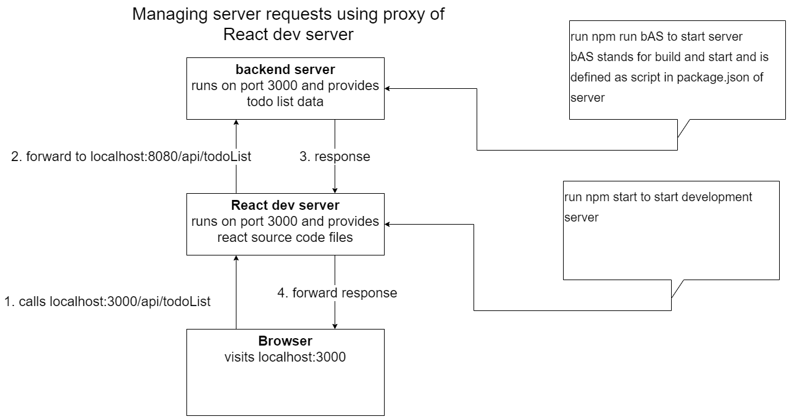

# nodejs-backend-for-react-bootcamp

This repository provides the small backend service for working in the React bootcamp.

## install and start

To start all required packages, please run `npm install`. For starting the server run `npm run bAS`.
When successfully started, the server runs on [http://localhost:8080/](http://localhost:8080/) 

## example of forwarding a request using proxy

